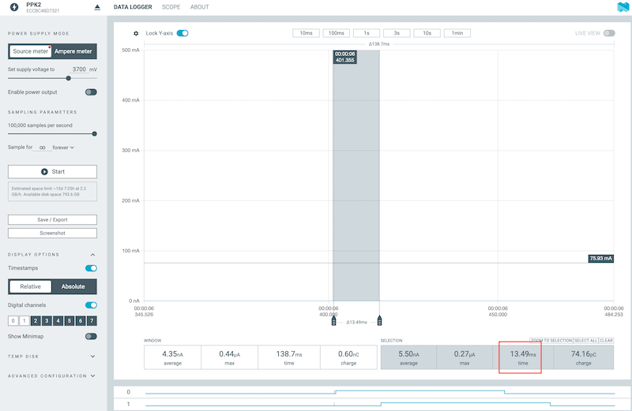

# Wi-Fi Packet Latency Test Application


> **High-precision Wi-Fi Raw IEEE 802.11 packet and UDP latency measurement tool for Nordic nRF7002 DK with external measurement equipment integration**

## 🔍 Overview

This application provides comprehensive Wi-Fi latency measurement capabilities using both UDP socket communication and Raw IEEE 802.11 packet transmission. It features GPIO-synchronized LED indicators that enable precision timing measurements with external equipment such as oscilloscopes or Nordic's PPK2 (Power Profiler Kit II).

The application supports multiple network topologies and transmission modes, making it ideal for analyzing Wi-Fi performance characteristics across different scenarios.

### 🎯 Key Features

- **📊 Precision Timing Measurement**: Hardware GPIO triggers synchronized with packet events
- **🔄 Dual Transmission Modes**: UDP socket and Raw IEEE 802.11 packet support
- **🌐 Multiple Network Topologies**: Direct connection, SoftAP, external AP, and monitor modes
- **⚡ GPIO Timing Integration**: LED flash synchronization for external measurement equipment
- **🔧 Flexible Configuration**: Kconfig-based parameter adjustment system
- **📈 Real-time Monitoring**: Comprehensive serial logging with timing data
- **🛠️ Modular Architecture**: Clean separation of Wi-Fi, UDP, Raw packet, LED, and event management modules
- **📊 Analysis Tools**: Python script for automated PPK2 data analysis

## 🧪 Test Scenarios

The application supports four distinct test scenarios, each optimized for different measurement requirements:

### Raw IEEE 802.11 Packet Tests

#### Test 1: Raw TX Non-Connected → Monitor RX
```
[TX Device] ──Raw 802.11──> [RX Device (Monitor)]
(Non-connected)                (Channel monitoring)
    ↓                               ↓
  LED1 Flash                    LED2 Flash
```
- TX device transmits raw beacon frames without network association
- RX device operates in monitor mode capturing all channel traffic
- Minimal protocol overhead for baseline latency measurement
- Configuration: `overlay-raw-tx-sta-non-conn.conf` and `overlay-raw-rx-monitor.conf`

### UDP Packet Tests

#### Test 2: UDP External Access Point Mode
```
[TX Device] ──WiFi──> [External AP] ──WiFi──> [RX Device]
    ↓                                             ↓
  LED1 Flash                                  LED2 Flash
```
- Both devices connect to an existing external Wi-Fi access point
- Suitable for testing real-world network latency scenarios
- Configuration: `overlay-udp-tx-sta.conf` and `overlay-udp-rx-sta.conf`

#### Test 3: UDP SoftAP Mode  
```
[TX Device] ──WiFi──> [RX Device (SoftAP)]
    ↓                        ↓
  LED1 Flash            LED2 Flash
```
- RX device creates its own access point, TX device connects directly
- Eliminates external network variables for controlled testing
- Configuration: `overlay-udp-tx-sta.conf` and `overlay-udp-rx-softap.conf`

## 🔧 Hardware Requirements

| Component | Specification | Notes |
|-----------|---------------|-------|
| **Main Board** | nRF7002 DK | Primary development board |
| **NCS Version** | v3.0.2  | Nordic Connect SDK |
| **Measurement Equipment** | PPK2 or Oscilloscope | For precision timing analysis |
| **USB Cable** | USB-C | For programming and serial communication |

### 📍 GPIO Pin Configuration (nRF7002 DK)

The application uses specific GPIO pins for timing trigger generation:

| Signal | GPIO Pin | Physical Location | LED | Purpose |
|--------|----------|-------------------|-----|---------|
| TX Trigger | P1.06 | Port 1, Pin 6 | LED1 | Packet transmission event |
| RX Trigger | P1.07 | Port 1, Pin 7 | LED2 | Packet reception event |

**Note**: These GPIO pins are automatically configured by the LED utilities module and flash simultaneously with their corresponding LED indicators.

## 🏗️ Project Architecture

The project follows a modular design pattern with clear separation of responsibilities:

```
wifi_latency_test/
├── src/
│   ├── main.c                      # Application entry point and test orchestration
│   ├── wifi_utils.c/.h             # Wi-Fi connection and configuration management
│   ├── udp_utils.c/.h              # UDP socket communication and packet handling
│   ├── raw_utils.c/.h              # Raw IEEE 802.11 packet transmission/reception
│   ├── led_utils.c/.h              # GPIO timing triggers and LED control
│   └── net_event_mgmt_utils.c/.h         # Network event handling and synchronization
├── script/
│   └── ppk_record_analysis.py      # PPK2 data analysis and latency calculation
├── overlay-udp-tx-sta.conf         # UDP TX device (Station mode)
├── overlay-udp-rx-sta.conf         # UDP RX device (Station mode)
├── overlay-udp-rx-softap.conf      # UDP RX device (SoftAP mode)
├── overlay-raw-tx-sta-non-conn.conf # Raw TX device (Non-connected mode)
├── overlay-raw-rx-monitor.conf     # Raw RX device (Monitor mode)
├── prj.conf                        # Base project configuration
├── Kconfig                         # Configuration options definitions
├── CMakeLists.txt                  # Build system configuration
└── boards/                         # Board-specific configurations
```

### Core Modules

- **`main.c`**: Coordinates test execution, handles button input, manages device roles
- **`wifi_utils`**: Provides Wi-Fi management APIs (connection, SoftAP setup, status reporting)
- **`udp_utils`**: Implements UDP socket communication for both TX and RX operations
- **`raw_utils`**: Handles raw IEEE 802.11 packet creation, injection, and monitoring
- **`led_utils`**: Manages GPIO timing triggers synchronized with packet events
- **`net_event_mgmt_utils`**: Processes network events and provides synchronization primitives

## 🚀 Quick Start Guide

### 1. Prerequisites

Ensure you have the Nordic Connect SDK environment properly configured:
- [Nordic Connect SDK v3.0.2](https://docs.nordicsemi.com/bundle/ncs-3.0.2/page/nrf/installation/install_ncs.html)
- West build tool
- nRF7002 DK hardware
- Compatible measurement equipment (PPK2 or oscilloscope)

### 2. Project Setup

Navigate to your NCS workspace and clone/copy the project:

```bash
cd /opt/nordic/ncs/v3.0.2  # Adjust to your NCS installation path
# Project should be available in wifi_latency_test/ directory
cd wifi_latency_test
```

### 3. Build Instructions

The build process varies depending on your chosen test scenario. Each configuration uses specific overlay files to enable the appropriate features.

#### Raw Packet Tests

**Test 1: Raw TX Non-connected → Monitor RX**
```bash
# Build TX Device (Non-connected mode)
west build -p -b nrf7002dk/nrf5340/cpuapp -- -DEXTRA_CONF_FILE=overlay-raw-tx-sta-non-conn.conf

# Build RX Device (Monitor mode)
west build -p -b nrf7002dk/nrf5340/cpuapp -- -DEXTRA_CONF_FILE=overlay-raw-rx-monitor.conf
```

#### UDP Packet Tests

**Test 2: External AP Mode**
```bash
# Build TX Device (Station mode)
west build -p -b nrf7002dk/nrf5340/cpuapp -- -DEXTRA_CONF_FILE=overlay-udp-tx-sta.conf

# Build RX Device (Station mode) 
west build -p -b nrf7002dk/nrf5340/cpuapp -- -DEXTRA_CONF_FILE=overlay-udp-rx-sta.conf
```

**Test 3: SoftAP Mode**
```bash
# Build TX Device (connects to SoftAP)
west build -p -b nrf7002dk/nrf5340/cpuapp -- -DEXTRA_CONF_FILE=overlay-udp-tx-sta.conf

# Build RX Device (creates SoftAP)
west build -p -b nrf7002dk/nrf5340/cpuapp -- -DEXTRA_CONF_FILE=overlay-udp-rx-softap.conf
```

### 4. Flash and Deploy

After building each configuration:

```bash
# Flash the device
west flash

```

**Important**: Build and flash each device separately with its corresponding configuration before proceeding to the next step. 

## ⚙️ Configuration Guide

The application uses Kconfig for flexible parameter configuration. Update the overlay files according to your test requirements.

### Wi-Fi Network Configuration

#### Test 1: Raw Packet Tests
Raw packet tests operate at the MAC layer and don't require network credentials:
- **TX Device**: Uses `overlay-raw-tx-sta-non-conn.conf` (no credentials needed)
- **RX Device**: Uses `overlay-raw-rx-monitor.conf` (no credentials needed)
- Both devices operate on the same channel (configurable, default: channel 2)

#### Test 2: External Access Point Mode
Update credentials in both `overlay-udp-tx-sta.conf` and `overlay-udp-rx-sta.conf`:

```properties
# Replace with your network credentials
CONFIG_WIFI_CREDENTIALS_STATIC_SSID="YourWiFiSSID"
CONFIG_WIFI_CREDENTIALS_STATIC_PASSWORD="YourWiFiPassword"
CONFIG_UDP_TX_DEV_TARGET_IP="192.168.1.100"  # IP address of RX device
```

#### Test 3: SoftAP Mode
**RX Device** (`overlay-udp-rx-softap.conf`) - Creates access point:
```properties
CONFIG_SOFTAP_SSID="wifi-latency-test"
CONFIG_SOFTAP_PASSWORD="testpass123"
```

**TX Device** (`overlay-udp-tx-sta.conf`) - Connects to SoftAP:
```properties
CONFIG_WIFI_CREDENTIALS_STATIC_SSID="wifi-latency-test"
CONFIG_WIFI_CREDENTIALS_STATIC_PASSWORD="testpass123"
CONFIG_UDP_TX_DEV_TARGET_IP="192.168.1.1"  # SoftAP IP address (fixed)
```

### Test Parameters Configuration

The following parameters can be adjusted in overlay files or through Kconfig:

#### Common Parameters
| Parameter | Config Option | Default | Description |
|-----------|---------------|---------|-------------|
| Test Duration | `CONFIG_WIFI_LATENCY_TEST_DURATION_MS` | 10000 | Total test time in milliseconds |
| Packet Interval | `CONFIG_WIFI_LATENCY_TEST_INTERVAL_MS` | 1000 | Time between transmissions (ms) |

#### UDP-Specific Parameters
| Parameter | Config Option | Default | Description |
|-----------|---------------|---------|-------------|
| UDP Port | `CONFIG_WIFI_LATENCY_TEST_SOCKET_PORT` | 12345 | Communication port number |
| Target IP | `CONFIG_UDP_TX_DEV_TARGET_IP` | "192.168.1.1" | RX device IP address |

#### Raw Packet Parameters
| Parameter | Config Option | Default | Description |
|-----------|---------------|---------|-------------|
| TX Channel | `CONFIG_RAW_TX_DEV_CHANNEL` | 2 | Wi-Fi channel for transmission |
| Monitor Channel | `CONFIG_RAW_RX_MONITOR_CHANNEL` | 2 | Wi-Fi channel for monitoring |
| Data Rate | `CONFIG_RAW_TX_DEV_RATE_VALUE` | 0x20 | Transmission rate (0x20 = 1 Mbps) |
| Injection Mode | `CONFIG_RAW_TX_DEV_INJECTION_ENABLE` | y | Enable packet injection |

## 🎮 Operation Guide

### Hardware Controls

| Component | Location | Function |
|-----------|----------|----------|
| **Button 1** | SW1 on nRF7002 DK | Start/restart packet transmission (TX devices only) |
| **LED1** | Built-in LED | TX trigger indication + GPIO P1.06 pulse |
| **LED2** | Built-in LED | RX trigger indication + GPIO P1.07 pulse |
| **Serial Console** | USB CDC-ACM | Real-time status and measurement data |

### Operation Sequence

1. **Setup Phase**:
   - Power on both devices
   - Monitor serial output for network connection status
   - Wait for "Ready" messages from both devices

2. **TX Device Operation**:
   - Press Button 1 to start transmission
   - LED1 flashes with each packet sent
   - Serial console shows transmission timestamps
   - Press Button 1 again to restart the test sequence

3. **RX Device Operation**:
   - Automatically listens for incoming packets
   - LED2 flashes with each packet received
   - Serial console shows reception timestamps
   - No user interaction required

### Status Indicators

| LED Pattern | Status | Description |
|-------------|--------|-------------|
| LED1 Flash | TX Event | Packet transmitted, GPIO P1.06 pulse generated |
| LED2 Flash | RX Event | Packet received, GPIO P1.07 pulse generated |
| No LED Activity | Idle/Error | Check serial console for status information |


## 📏 Precision Timing Measurement

### Measurement Equipment Setup

#### Using PPK2 (Power Profiler Kit II)

The PPK2 provides digital channel monitoring with 10μs resolution, ideal for latency measurements.

**Hardware Connections**:
1. **D0 Channel**: Connect to GPIO P1.06 (TX trigger)
2. **D1 Channel**: Connect to GPIO P1.07 (RX trigger)  
3. **Ground**: Connect to nRF7002 DK ground reference
   


**PPK2 Configuration**:
- **Sampling Rate**: 100kHz maximum (10μs resolution)
- **Digital Channels**: Enable D0 and D1 monitoring
- **Trigger Setup**: Use D0 rising edge as measurement trigger



**Data Export Process**:
1. Record test session using Power Profiler software
2. Select time window containing measurement data
3. Export to CSV format with "Timestamp" and "Digital logic pins (separate fields)" options

#### Using Oscilloscope

For higher resolution measurements, use a dual-channel oscilloscope:

**Connections**:
- **Channel 1**: GPIO P1.06 (TX trigger) 
- **Channel 2**: GPIO P1.07 (RX trigger)
- **Common Ground**: nRF7002 DK ground

**Oscilloscope Settings**:
- **Trigger**: Rising edge on Channel 1 (TX event)
- **Time Base**: 1-10ms/div (depending on expected latency)
- **Voltage**: 3.3V logic levels
- **Coupling**: DC coupling recommended

**Measurement Method**:
```
Latency = Time(CH2 Rising Edge) - Time(CH1 Rising Edge)
```

### Automated PPK2 Data Analysis

The included Python script automates latency calculation from PPK2 CSV exports:

```bash
# Navigate to script directory
cd script/

# Basic analysis
python ppk_record_analysis.py -i your_recording.csv

# Save results to file
python ppk_record_analysis.py -i your_recording.csv -o results.md

# Custom latency threshold (default: 300ms)
python ppk_record_analysis.py -i your_recording.csv -m 50.0
```

**Script Features**:
- **Automatic Detection**: Identifies TX (D0) and RX (D1) trigger events
- **Intelligent Pairing**: Matches TX/RX events with temporal proximity
- **Statistical Analysis**: Calculates min/max/average latencies
- **Markdown Output**: Generates formatted tables for documentation
- **Error Handling**: Validates data format and filters invalid measurements

**Expected CSV Format** (PPK2 export):
```csv
Timestamp(ms),D0,D1,D2,D3,D4,D5,D6,D7
0.000,0,0,1,1,1,1,1,1
0.010,0,0,1,1,1,1,1,1
0.020,1,0,1,1,1,1,1,1  ← D0 rising edge (TX trigger)
0.030,1,1,1,1,1,1,1,1  ← D1 rising edge (RX trigger)
```

## 📊 Test Results and Performance Analysis

### Measurement Results Summary

The following results were obtained using PPK2 measurements with 10μs resolution:

#### Test 1: Raw TX Non-Connected → Monitor RX
Network topology: TX Device (Non-connected) → RX Device (Monitor Mode)
| Packet Number | TX Trigger Time (ms) | RX Trigger Time (ms) | Latency (ms) |
|---------------|---------------------|---------------------|-------------|
| 0 | 29047.27 | 29050.15 | **2.88** |
| 1 | 30055.61 | 30058.14 | **2.53** |
| 2 | 31063.43 | 31065.87 | **2.44** |
| 3 | 32071.33 | 32073.80 | **2.47** |
| 4 | 33079.20 | 33082.85 | **3.65** |
| 5 | 34087.08 | 34089.54 | **2.46** |
| 6 | 35094.95 | 35097.39 | **2.44** |
| 7 | 36102.82 | 36105.63 | **2.81** |
| 8 | 37110.69 | 37113.14 | **2.45** |
| 9 | 38118.56 | 38121.08 | **2.52** |
|---------------|---------------------|---------------------|-------------|
| **Average** | - | - | **2.66** |
| **Minimum** | - | - | **2.44** |
| **Maximum** | - | - | **3.65** |


#### Test 2: UDP SoftAP Mode  
Network topology: TX Device → RX Device (SoftAP)

| Packet Number | TX Trigger Time (ms) | RX Trigger Time (ms) | Latency (ms) |
|---------------|---------------------|---------------------|-------------|
| 0 | 1449.94 | 1452.93 | **2.99** |
| 1 | 2466.78 | 2469.18 | **2.40** |
| 2 | 3483.35 | 3487.05 | **3.70** |
| 3 | 4499.92 | 4505.45 | **5.53** |
| 4 | 5516.55 | 5519.04 | **2.49** |
| 5 | 6533.12 | 6538.37 | **5.25** |
| 6 | 7549.66 | 7563.68 | **14.02** |
| 7 | 8565.87 | 8571.47 | **5.60** |
| 8 | 9582.43 | 9585.32 | **2.89** |
| 9 | 10598.97 | 10601.91 | **2.94** |
|---------------|---------------------|---------------------|-------------|
| **Average** | - | - | **4.78** |
| **Minimum** | - | - | **2.40** |
| **Maximum** | - | - | **14.02** |

#### Test 3: UDP External Access Point Mode (Alternative Network)
Network topology: TX Device → External AP → RX Device (Different AP)

| Packet Number | TX Trigger Time (ms) | RX Trigger Time (ms) | Latency (ms) |
|---------------|---------------------|---------------------|-------------|
| 0 | 826.70 | 843.81 | **17.11** |
| 1 | 1843.63 | 1857.05 | **13.42** |
| 2 | 2860.23 | 2864.12 | **3.89** |
| 3 | 3876.83 | 3891.86 | **15.03** |
| 4 | 4893.43 | 4906.61 | **13.18** |
| 5 | 5910.03 | 5932.83 | **22.80** |
| 6 | 6926.69 | 6934.11 | **7.42** |
| 7 | 7943.35 | 7962.77 | **19.42** |
| 8 | 8959.92 | 8989.10 | **29.18** |
| 9 | 9976.55 | 9989.36 | **12.81** |
|---------------|---------------------|---------------------|-------------|
| **Average** | - | - | **15.43** |
| **Minimum** | - | - | **3.89** |
| **Maximum** | - | - | **29.18** |


## 📖 Documentation

### [Wi-Fi Raw and UDP Packet Latency Comparison](wifi_raw_and_udp_packets_latency_comparison.md)

Comprehensive technical analysis covering:
- **Protocol Stack Comparison**: Detailed breakdown of UDP vs Raw packet transmission paths
- **SoftAP Implementation**: Performance considerations for both transmission methods  
- **Benchmark Results**: Extensive latency measurements across different scenarios
- **Architecture Guidance**: When to choose Raw vs UDP approaches for specific use cases
- **Implementation Details**: Code examples and configuration recommendations

This companion document provides theoretical foundation and practical guidance for optimizing Wi-Fi latency measurements based on your specific requirements.
## 📞 Support

- **Issues**: [GitHub Issues](https://github.com/chshzh/wifi_latency_test/issues)
- **Discussions**: [GitHub Discussions](https://github.com/chshzh/wifi_latency_test/discussions)
- **Nordic DevZone**: [devzone.nordicsemi.com](https://devzone.nordicsemi.com/)
- **Documentation**: [nRF Connect SDK Documentation](https://developer.nordicsemi.com/nRF_Connect_SDK/doc/latest/nrf/index.html)

## 📝 License

Copyright (c) 2025 Nordic Semiconductor ASA

[SPDX-License-Identifier: LicenseRef-Nordic-5-Clause](LICENSE)
---

**⭐ If this project helps you, please consider giving it a star!** 